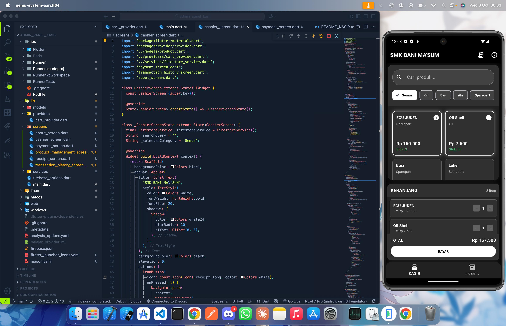

# 🏪 Aplikasi Kasir SMK Bani Ma'sum

<div align="center">
  


[](LICENSE)
[](CHANGELOG.md)

</div>

> **Aplikasi kasir modern untuk bengkel sekolah SMK Bani Ma'sum dengan desain hitam putih bercahaya dan fitur lengkap untuk manajemen penjualan.**

---

## 📸 Screenshots

<div align="center">

### 🏠 Halaman Utama Kasir

*Tampilan utama kasir dengan grid produk dan keranjang belanja*

</div>

---

## ✨ Fitur Unggulan

### 💰 **Sistem Kasir Canggih**
- ✅ **Penjualan Barang**: Tambah barang ke keranjang dengan satu klik
- ✅ **Pembayaran Tunai**: Input uang cash dengan perhitungan otomatis  
- ✅ **Perhitungan Kembalian**: Hitung kembalian secara real-time
- ✅ **Tombol Uang Pas**: Cepat untuk jumlah yang tepat
- ✅ **Validasi Uang**: Pastikan uang cukup sebelum proses

### 🧾 **Cetak Struk Profesional**
- ✅ **Struk Lengkap**: Header sekolah, tanggal, ID transaksi
- ✅ **Detail Item**: Nama, quantity, harga satuan, total per item
- ✅ **Ringkasan Transaksi**: Subtotal, total, tunai, kembalian
- ✅ **Desain Cetak**: Format siap cetak thermal printer

### 📦 **Manajemen Barang Lengkap**
- ✅ **CRUD System**: Create, Read, Update, Delete barang
- ✅ **Pencarian Cepat**: Cari barang berdasarkan nama
- ✅ **Filter Kategori**: Oli, Ban, Aki, Sparepart, Lainnya
- ✅ **Stok Real-time**: Update otomatis setelah transaksi
- ✅ **Validasi Stok**: Cek ketersediaan sebelum penjualan

### 📊 **Riwayat Transaksi**
- ✅ **50 Transaksi Terakhir**: Tampilkan dengan pagination
- ✅ **Detail Lengkap**: Items, total, kasir, waktu transaksi
- ✅ **Pencarian**: Cari berdasarkan ID transaksi
- ✅ **Tampilan Modern**: Card design dengan informasi jelas

### 🎨 **Desain Modern & Responsive**
- ✅ **Tema Hitam Putih**: Desain elegan dengan efek cahaya
- ✅ **Responsive Layout**: Mobile & tablet support
- ✅ **Material Design**: Following Android design guidelines
- ✅ **Smooth Animation**: Transisi halus antar screen

### 🔗 **Integrasi Lengkap**
- ✅ **Portfolio Developer**: Link ke https://hadiramdhanii.web.app
- ✅ **Firebase Real-time**: Sinkronisasi data otomatis
- ✅ **Error Handling**: Penanganan error yang baik
- ✅ **Loading States**: Indikator loading yang informatif

---

## 🚀 Teknologi Modern

<div align="center">

| Teknologi | Versi | Kegunaan |
|-----------|-------|----------|
|  | 3.9.2+ | Framework UI cross-platform |
|  | Latest | Database real-time & backend |
|  | 6.1.5+ | State management |
|  | 3.9.2+ | Bahasa pemrograman |
|  | 6.3.0+ | Buka link eksternal |

</div>

---

## 📁 Struktur Proyek

```
adminpanelkasir/
├── android/                    # Konfigurasi Android
├── ios/                       # Konfigurasi iOS
├── lib/                       # Kode utama Flutter
│   ├── main.dart             # Entry point aplikasi
│   ├── firebase_options.dart # Konfigurasi Firebase
│   ├── models/
│   │   ├── product.dart      # Model data barang
│   │   └── transaction.dart  # Model data transaksi
│   ├── providers/
│   │   └── cart_provider.dart # State management keranjang
│   ├── services/
│   │   └── firestore_service.dart # Service Firebase
│   └── screens/
│       ├── cashier_screen.dart      # Halaman utama kasir
│       ├── payment_screen.dart      # Halaman pembayaran
│       ├── receipt_screen.dart      # Halaman struk
│       ├── product_management_screen.dart # Manajemen barang
│       ├── transaction_history_screen.dart # Riwayat transaksi
│       └── about_screen.dart        # Tentang aplikasi
├── screenshots/              # Screenshot aplikasi
├── pubspec.yaml             # Dependencies & konfigurasi
└── README.md               # Dokumentasi ini
```

---

## 🛠️ Instalasi & Setup

### 📋 Prasyarat Sistem

- **Flutter SDK**: ^3.9.2
- **Dart SDK**: ^3.9.2
- **Android Studio**: 4.0+ / **VS Code**: Latest
- **Firebase Account**: Gratis di firebase.google.com
- **Git**: Untuk version control

### 🔧 Langkah Instalasi

#### 1. Clone Repository
```bash
# Clone repository
git clone https://github.com/hadiramdhani/adminpanelkasir.git

# Masuk ke directory
cd adminpanelkasir
```

#### 2. Install Dependencies
```bash
# Install semua package
flutter pub get

# Verifikasi instalasi
flutter doctor
```

#### 3. Setup Firebase
<details>
<summary>🔥 Klik untuk setup Firebase</summary>

1. **Buat Project Firebase**
   - Buka [Firebase Console](https://console.firebase.google.com/)
   - Klik "Add Project" → Nama: `kasir-smk-bani-masum`
   - Enable Google Analytics (optional)

2. **Download Config Files**
   - **Android**: Download `google-services.json`
     - Letakkan di: `android/app/`
   - **iOS**: Download `GoogleService-Info.plist`
     - Letakkan di: `ios/Runner/`

3. **Enable Firestore Database**
   - Firebase Console → Firestore Database → Create Database
   - Pilih mode: **Production**
   - Lokasi: **asia-southeast1** (Singapore)

4. **Setup Authentication** (Optional)
   - Firebase Console → Authentication → Get Started
   - Enable **Anonymous** sign-in method
</details>

#### 4. Konfigurasi Database
<details>
<summary>📊 Setup Collection Firestore</summary>

**Collection: `products`**
```javascript
{
  "name": "Oli Motor 1L",
  "category": "Oli", 
  "price": 45000,
  "stock": 25,
  "created_at": "timestamp"
}
```

**Collection: `transactions`**
```javascript
{
  "items": [
    {
      "product": { /* product data */ },
      "quantity": 2
    }
  ],
  "totalAmount": 90000,
  "cashAmount": 100000,
  "changeAmount": 10000,
  "transactionDate": "timestamp",
  "cashierName": "Kasir SMK Bani Ma'sum"
}
```
</details>

#### 5. Jalankan Aplikasi
```bash
# Run di device/emulator
flutter run

# Build APK (Android)
flutter build apk --release

# Build untuk web
flutter build web --release
```

---

## 📱 Cara Penggunaan

### 🛒 Transaksi Penjualan

<details>
<summary>Langkah-langkah transaksi</summary>

1. **Pilih Barang**
   - Klik barang di grid produk
   - Atur jumlah di keranjang (tombol + / -)
   - Lihat total otomatis di bagian bawah

2. **Proses Pembayaran**
   - Klik tombol **BAYAR** hijau
   - Masukkan jumlah uang di field
   - Gunakan tombol **UANG PAS** untuk cepat
   - Lihat perhitungan kembalian otomatis

3. **Selesaikan Transaksi**
   - Klik **PROSES** jika uang cukup
   - Lihat struk transaksi
   - Pilih **CETAK STRUK** atau **TRANSAKSI BARU**
</details>

### 📦 Manajemen Barang

<details>
<summary>Kelola inventory</summary>

1. **Tambah Barang Baru**
   - Klik tombol **+** di app bar
   - Isi: Nama, Kategori, Harga, Stok
   - Klik **TAMBAH** untuk simpan

2. **Edit Barang**
   - Klik ikon pensil di item barang
   - Ubah data yang diinginkan
   - Klik **UPDATE** untuk simpan perubahan

3. **Hapus Barang**
   - Klik ikon sampah di item barang
   - Konfirmasi penghapusan
   - Barang akan terhapus permanen

4. **Cari Barang**
   - Gunakan search bar di atas
   - Ketik nama barang
   - Hasil muncul secara real-time
</details>

### 📊 Lihat Riwayat Transaksi

<details>
<summary>Monitor penjualan</summary>

1. **Akses Riwayat**
   - Klik ikon riwayat di app bar utama
   - Lihat 50 transaksi terakhir otomatis

2. **Detail Transaksi**
   - Klik card transaksi
   - Lihat: items, total, kasir, waktu
   - Klik **TUTUP** untuk kembali

3. **Informasi yang Ditampilkan**
   - ID transaksi unik
   - Tanggal & waktu pembelian
   - Jumlah item dan total
   - Nama kasir yang melayani
</details>

### ℹ️ About App & Portfolio

<details>
<summary>Tentang aplikasi</summary>

1. **Buka About App**
   - Klik ikon **info** di app bar utama
   - Lihat informasi aplikasi lengkap

2. **Portfolio Developer**
   - Klik **BUKA PORTFOLIO HADI RAMDHANI**
   - Akan membuka browser ke https://hadiramdhanii.web.app
   - Jika error, akan tampil notifikasi

3. **Informasi yang Tersedia**
   - Deskripsi aplikasi
   - Fitur-fitur utama
   - Teknologi yang digunakan
   - Developer info lengkap
</details>

---

## 🔧 Troubleshooting

### ❌ Error Firestore Index
<details>
<summary>Solusi index error</summary>

**Error**: `The query requires an index`
**Solusi**:
1. Buka link error di Firebase Console
2. Klik **Create Index**
3. Tunggu 5-10 menit hingga selesai
4. Restart aplikasi

**Alternatif**: Kami sudah hapus `.orderBy()` yang menyebabkan error
</details>

### ❌ Overflow di Layar Kecil
<details>
<summary>Fix overflow issues</summary>

**Masalah**: Widget overflow di layar < 600px
**Solusi**: 
- Gunakan `LayoutBuilder` untuk responsive layout
- Implementasi `Expanded` dan `Flexible`
- Gunakan `SingleChildScrollView` untuk content panjang
- Optimasi ukuran font dan padding

**Status**: ✅ Sudah diperbaiki di semua layar
</details>

### ❌ ITEM PEMBELIAN Kosong
<details>
<summary>Fix empty items in receipt</summary>

**Masalah**: Cart di-clear setelah transaksi
**Solusi**: 
- Ambil data transaksi dari Firestore
- Gunakan `getTransaction()` method
- Tampilkan data asli dari database

**Status**: ✅ Sudah diperbaiki di receipt_screen.dart
</details>

---

## 🚀 Performance & Optimization

### ⚡ Best Practices
- ✅ **State Management**: Provider untuk efisiensi
- ✅ **Lazy Loading**: Data loading sesuai kebutuhan  
- ✅ **Image Optimization**: Icon-based design
- ✅ **Memory Management**: Proper disposal controllers
- ✅ **Error Boundaries**: Try-catch di semua async operations

### 📊 Firebase Optimization
- ✅ **Composite Indexes**: Untuk query kompleks
- ✅ **Pagination**: Limit 50 documents untuk performance
- ✅ **Real-time Updates**: Stream untuk live data
- ✅ **Offline Support**: Firestore offline persistence

---

## 🎯 Roadmap & Future Updates

### 🔮 Fitur yang Akan Datang
- [ ] **Multi-user Support**: Login untuk kasir berbeda
- [ ] **Laporan Penjualan**: PDF export untuk laporan
- [ ] **Barcode Scanner**: Scan barcode untuk cepat
- [ ] **Stock Alert**: Notifikasi stok habis
- [ ] **Multi-language**: Bahasa Indonesia & Inggris
- [ ] **Dark/Light Theme**: Toggle theme support
- [ ] **Backup & Restore**: Export/import database
- [ ] **Thermal Printer**: Support printer bluetooth

### 🐛 Known Issues
- [ ] Firestore index building (butuh waktu 5-10 menit pertama kali)
- [ ] URL launcher butuh internet untuk membuka portfolio
- [ ] Print functionality masih placeholder (butuh thermal printer)

---

## 🤝 Contributing

Kami terbuka untuk kontribusi! Silakan:

1. **Fork** repository ini
2. **Create** feature branch (`git checkout -b feature/AmazingFeature`)
3. **Commit** perubahan (`git commit -m 'Add some AmazingFeature'`)
4. **Push** ke branch (`git push origin feature/AmazingFeature`)
5. **Open** Pull Request

### 📋 Code Style
- Gunakan `flutter format` sebelum commit
- Ikuti pedoman Flutter [style guide](https://flutter.dev/docs/development/tools/formatting)
- Tambahkan komentar untuk logic kompleks
- Update dokumentasi jika menambah fitur

---

## 📞 Support & Kontak

### 👨‍💻 Developer
**Hadi Ramdhani** - Full Stack Developer
- 📧 **Email**: hadiramdhani09@gmail.com
- 🌐 **Portfolio**: [https://hadiramdhanii.web.app](https://hadiramdhanii.web.app)
- 🐙 **GitHub**: [@hadiramdhani](https://github.com/HadiOnZero)

### 🏫 Sekolah
**SMK Bani Ma'sum**
- 📍 **Alamat**: Jl. Raya Cimanggu, Kec. Cisalak, Kab. Subang
- 📞 **Kontak**: (Contoh) 085864459490
- 🌐 **Website**: [smkbanimasum.sch.id](https://smkbanimasum.sch.id)

---

## 📄 License & Copyright

```
MIT License - SMK Bani Ma'sum

Copyright (c) 2025 SMK Bani Ma'sum
Developer: Hadi Ramdhani

Permission is hereby granted, free of charge, to any person obtaining a copy
of this software and associated documentation files (the "Software"), to deal
in the Software without restriction, including without limitation the rights
to use, copy, modify, merge, publish, distribute, sublicense, and/or sell
copies of the Software, and to permit persons to whom the Software is
furnished to do so, subject to the following conditions:

The above copyright notice and this permission notice shall be included in all
copies or substantial portions of the Software.

THE SOFTWARE IS PROVIDED "AS IS", WITHOUT WARRANTY OF ANY KIND, EXPRESS OR
IMPLIED, INCLUDING BUT NOT LIMITED TO THE WARRANTIES OF MERCHANTABILITY,
FITNESS FOR A PARTICULAR PURPOSE AND NONINFRINGEMENT. IN NO EVENT SHALL THE
AUTHORS OR COPYRIGHT HOLDERS BE LIABLE FOR ANY CLAIM, DAMAGES OR OTHER
LIABILITY, WHETHER IN AN ACTION OF CONTRACT, TORT OR OTHERWISE, ARISING FROM,
OUT OF OR IN CONNECTION WITH THE SOFTWARE OR THE USE OR OTHER DEALINGS IN THE
SOFTWARE.
```

---

## 🙏 Acknowledgments

*Terima kasih kepada:*

- **Allah SWT** - Segala puji hanya bagi-Nya
- **Orang Tua** - Doa dan dukungannya tak ternilai  
- **SMK Bani Ma'sum** - Kepercayaan untuk mengembangkan aplikasi ini
- **Flutter Team** - Framework luar biasa
- **Firebase Team** - Backend yang handal dan gratis
- **Stack Overflow** - Solusi untuk setiap masalah
- **Flutter Community** - Tutorial dan dokumentasi lengkap

---

<div align="center">

## ⭐ Jika Anda Menyukai Proyek Ini

**Berikan ⭐ di GitHub!**  
Itu gratis dan membantu developer lain menemukan proyek ini.

[](https://github.com/HadiOnZero/adminpanelkasir)

</div>

---

<div align="center">

**Made with ❤️ and ☕ by Hadi Ramdhani**  
*Full Stack Developer | Flutter Enthusiast*

[](https://hadiramdhanii.web.app)
[](https://flutter.dev)

</div>
